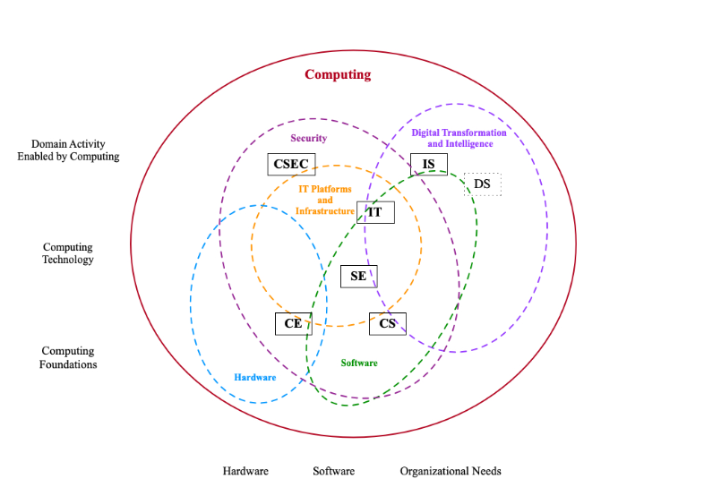
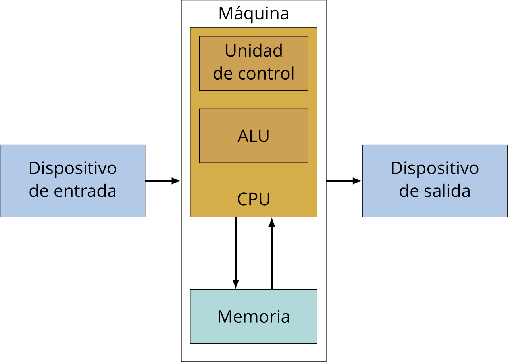

# ¿Qué es la informática?

Aclaración: Informática --> Ciencia de Computadores.

## ¿Ingeniería de Sistemas?

La ingeniería de sistemas es un enfoque transdisciplinar que permite la construcción, desarrollo, creación, uso y, disposición final de sistemas complejos de ingeniería, basándose en conceptos científicos, tecnológicos y de administración.

Fuente: [INCOSE - https://www.incose.org/](https://www.incose.org/)

---

# Ingeniería de Sistemas

 
Aplicaciones de la ingeniería de sistemas[^1] 

[^1]: http://commons.wikimedia.org/wiki/Image:Jsc2006e43519.jpg

---

# Informática o ciencias de la computación

Lo primero entonces es definir que es la computación.

Es algo diverso, que se explica mejor explicando las partes.

Intuitivamente, disciplina(s) que trata con el diseño, uso y aprovechamiento de los computadores.

---

---

# ¿Qué es un sistema?

Un conjunto de elementos, cuyas partes están relacionadas entre si.  Puede ser material o conceptual.  Se espera que aparezcan comportamientos emergentes.

La confusión del proviene del término "Sistemas de computo", muy probablemente.

---

# Ejemplos de sistemas

---

# ¿Qué es un computador?

Es una máquina para hacer operaciones de propósito general consideradas intelectuales. 

---

# Conceptualización de un computador

[Máquina de Von Neumann.](https://en.wikipedia.org/wiki/Von_Neumann_architecture)

---

# Hardware y software

* Hardware: infraestructura física, en tiempos actuales, los dispositivos electrónicos en los que se realizan las operaciones. (relacionado con 'sustrato)
* Software: los programas, el conjunto de programas, rutinas, etc, que permiten que el computador haga las tareas.
* Coloquialmente: "Hardware es lo que se golpea, Software es lo que se maldice, cuando algo sale mal".

---

# Clasificación del Software

* Software de sistema -> Sistema operativo y adyacentes.
* Software de aplicación.
    * Software de construcción de programas.

---

# Sistemas operativos y otro software del sistema

