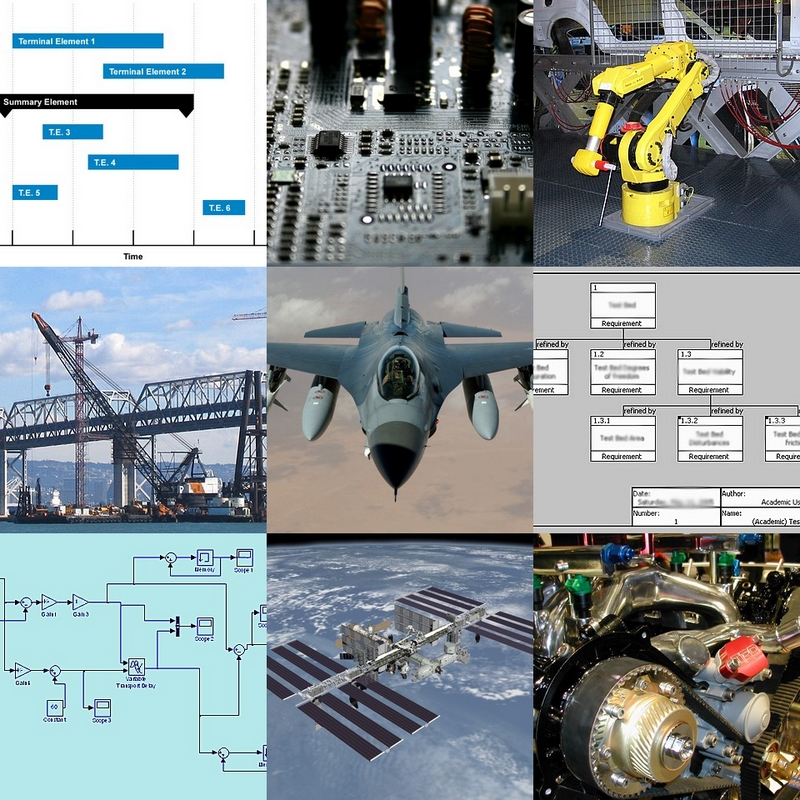
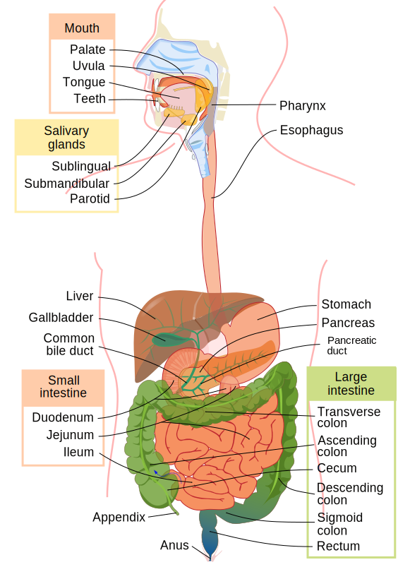

# Introducción a la computación - Temas básicos

Realizado por: Sergio Augusto Gélvez Cortés
MMXXIV

---

# ¿Qué es la informática?

Aclaración: Informática es básicamente los mismo que Ciencia de Computadores.

## ¿Ingeniería de Sistemas?

La ingeniería de sistemas es un enfoque transdisciplinar que permite la construcción, desarrollo, creación, uso y, disposición final de sistemas complejos de ingeniería, basándose en conceptos científicos, tecnológicos y de administración.

Fuente: [INCOSE - https://www.incose.org/](https://www.incose.org/)

---

# Ingeniería de Sistemas

 
Aplicaciones de la ingeniería de sistemas[^1] 

[^1]: http://commons.wikimedia.org/wiki/Image:Jsc2006e43519.jpg

---

# Informática o ciencias de la computación

Lo primero entonces es definir que es la computación.

Es algo diverso, que se explica mejor explicando las partes.

Intuitivamente, disciplina(s) que trata con el diseño, uso y aprovechamiento de los computadores.

---

---

# ¿Qué es un sistema?

Un conjunto de elementos, cuyas partes están relacionadas entre si.  Puede ser material o conceptual.  Se espera que aparezcan comportamientos emergentes.

La confusión del proviene del término "Sistemas de computo", muy probablemente.

---

# Ejemplos de sistemas

---

---

### Sistema de escritura

---

# ¿Qué es un computador?

Es una máquina para hacer operaciones de propósito general consideradas intelectuales. 

---

# Programas y algoritmos

### Programas

Son conjuntos de instrucciones que se entregan al computador para que realice una tarea.

### Algoritmos
 Es una descripción de un conjunto de instrucciones que se realizan para resolver un problema.

*Un programa es un concretización de un algoritmo, teniendo en cuenta un lenguaje objetivo* 

---

# Conceptualización de un computador

[Máquina de Von Neumann.](https://en.wikipedia.org/wiki/Von_Neumann_architecture)

---

# Hardware y software

* Hardware: infraestructura física, en tiempos actuales, los dispositivos electrónicos en los que se realizan las operaciones. (relacionado con 'sustrato)
* Software: los programas, el conjunto de programas, rutinas, etc, que permiten que el computador haga las tareas.
> Coloquialmente - Hardware es lo que se golpea, Software es lo que se maldice, cuando algo sale mal.

---

# Clasificación del Software

* Software de sistema -> Sistema operativo y adyacentes.
* Software de aplicación.
    * Software de construcción de programas.

---

# Sistemas operativos y otro software del sistema

Son los programas necesarios para el computador funcione correctamente.  Si toda la funcionalidad básica del computador viniera en el hardware los costos de diseño y construcción (además de otros factores) los harían inviables. Un sistema operativo seguramente tendrá:

* Un nucleo donde se definen los accesos a los recursos, así como donde se alojan los controladores de los dispositivos hardware del sistema.
* Subsistemas de entrada / salida de datos
* Un mecanismo para dar instrucciones al sistema.

---

# Software para construir software

Lenguajes de programación y sus compiladores.  Estas dos herramientas en conjunto (además de otras accesorias) permiten construir todo tipo de programas.

Los hay de muchos tipos, para diversos propósitos y se pueden clasificar de varias maneras.

---

# Actividad

Realizar una revisión basándose en las siguientes preguntas:

* ¿Cómo se pueden clasificar los sistemas operativos?
* ¿Cuáles son los principales sistemas operativos que existen en la actualidad?
* Aparte de los más populares, ¿existen otros sistemas operativos actuales o históricos con notoreidad?
* ¿Qué diferencia hay entre un lenguaje de programación, el lenguaje, el idioma, el sistema de escritura? De ejemplos de cada uno, cuando corresponda.

---

* ¿Cuáles son los lenguajes de programación más populares en la actualidad? Además, nombre otros (al menos 15).  De entre estos, ¿cuáles se pueden considerar emergentes o nuevos?
* ¿Cómo se pueden clasificar los lenguajes de programación?

---

# Historia de los computadores

Hay varias formas de dividir la historia de los computadores.  Una es por los componentes hardware utilizados:

| Generación          | Período       | Componente      |
| ---                 | ---           | ---             |
| Primera generación  | 1940s - 1950s | Tubos de vacío  |
| Segunda generación  | 1950s - 1960s | Transistores    |
| Tercera generación  | 1960s - 1970s | Circuitos integrados  |
| Cuarta generación   | 1970s - Presente | Microprocesador |
| Quinta generación   | Ahora y el futuro | Varias tendencias |

---

# Tubos de vacío

Se utilizaban para realizar funciones de interrupción. (La electrónica digital se basa en la interrupción condicional de la corriente)

By Stefan Riepl (Quark48) - Self-photographed, CC BY-SA 2.0 de, https://commons.wikimedia.org/w/index.php?curid=14682022

---

https://commons.wikimedia.org/wiki/File:ENIAC_Penn2.jpg

---

# Transistores

Cumplen una función similar a los tubos de vacío, pero basándose en propiedades de los semiconductores.  Mucho menos frágiles.

https://commons.wikimedia.org/wiki/File:Transistorer_(cropped).jpg</spam>

---

# Circuitos Integrados

Un circuito en el que todos o varios de sus elementos están asociados e interconectados de manera indivisible. No solo transistores, sino otros elementos.  Funcionalmente independientes.

http://www.jedec.org/standards-documents/dictionary/terms/integrated-circuit-ic https://upload.wikimedia.org/wikipedia/commons/4/4f/AD570JD.jpg

___

<!---
Falta incluir lo de los tipos de software y eso
-->

# Sistemas de numeración

Conjunto de reglas y símbolos que permiten representar datos o cantidades numéricas.

El más antiguo de todos:  El mesopotámico, con base 60. https://en.wikipedia.org/wiki/History_of_ancient_numeral_systems

---

# Sistemas no posicionales

* Sistema romano: I, II, III, IV, V, VI, ... , X, L, C, D, M, ... : Se basa en la representación de las cantidades agregando símbolos base hasta completar la cantidad deseada, usualmente a la derecha. No tiene una base definida, sino un conjunto de símbolos "primitivos".
* Sistema chino: Es base 10, y los incrementos de 10 y sus múltiplos se marcan con caractéres que denotan esas cantidades, como una especie de combinación lineal.
* Diversos sistemas helénicos y helenísticos: Son bastante incómodos, ya que algunos tienen infinidad de símbolos "primitivos".

---

Sistema chino: https://math.libretexts.org/Courses/Hartnell_College/Mathematics_for_Elementary_Teachers/03%3A_Counting_and_Numerals/3.02%3A_Numeration_Systems

Sistemas helénicos: https://www.hellenicaworld.com/Greece/Science/en/Counting.html.

---

# Sistemas posicionales

* Los símbolos básicos o primitivos tienen valor dependiendo de la posición.  
* Hay tantos símbolos como el valor de la base.

---

# Como convertir valores de una base a otra:

* importantísimo antes de empezar: nuestra operaciones están concebidas para base 10, entonces base 10 se usa como punto común (por comodidad)
* De un número en otra base a base 10: combinación lineal de las potencias de la base, empezando por 1.
* De un número en base 10 a otra base: División sucesiva por el valor de la base, tomando los residuos

---

# Conceptos básicos de programación

* Algebra booleana: https://www.geeksforgeeks.org/boolean-algebra/
* Valores y variables
* Tipos de instrucciones

---

# Valores y variables

Un valor es una representación de un concepto, una pieza de información, podría decirse un dato. Un valor está caracterizado por un tipo de dato.

Una variable es una representación de un valor general, que puede cambiar a lo largo de la ejecución de un programa. Puede guardar un valor a la vez

---

# Tipos de datos

Un tipo de dato es una especificación de como guardar un valor en la memoria, así como de las reglas de representación del mismo.  De la misma manera, es una especificación de como crear variables en memoria.

Está intrinsecamente relacionado con la forma de guardar y representar valores en la memoria principal del computador.

---

# Tipos de instrucciones

* Asignaciones
* Condicionales
* Iteraciones
* *Declaraciones*
* *llamadas o invocaciones*

---

# Preguntas

1. ¿Que es una expresión?
2. ¿Que es un valor izquierdo y un valor derecho?
3. ¿Que es un statement?
4. ¿Cómo se almacenan los números en memoria en un programa de python? ¿En uno de C?

---

# Diagramas de flujo

Un diagrama de flujo o diagrama de actividades es una manera de representar gráficamente un algoritmos o proceso a través de una serie de pasos estructurados o vinculados que permiten su revisión como un todo.

---

# En construcción...

---